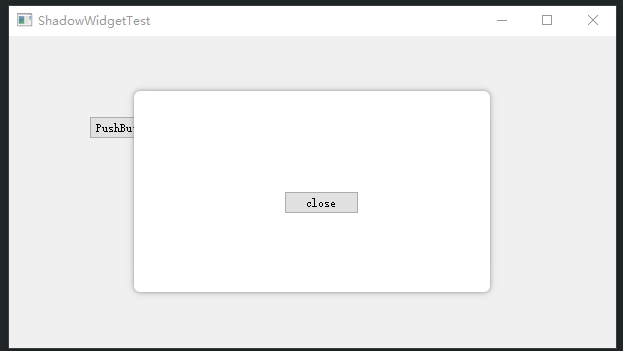

## ShadowWidget
这是一个阴影圆角弹窗基类，原理是在对象弹窗外包裹一层widget，使用stylesheet设置圆角和背景，QGraphicsDropShadowEffect实现阴影
## 使用
1. 创建1个widget例如SwDialog继承ShadowWidget，并创建1个SwDialog对应的ui文件
```c++
#pragma once

#include "widget\ShadowWidget.h"
#include "ui_swdialog.h"

class SwDialog : public ShadowWidget {
public:
	SwDialog(QWidget* parent);

private:
	Ui::SwDialog ui;
};
```
2. 在构造函数把ui交给基类使用
```c++
#include "SwDialog.h"

SwDialog::SwDialog(QWidget* parent) : ShadowWidget(parent) {
	setWindowFlag(Qt::Dialog);
	setWindowModality(Qt::ApplicationModal);
	setupUi(ui);

	connect(ui.close, &QPushButton::clicked, this, &QWidget::close);
}
```
这里调用基类的setupUi将ui实例传入，由于setupUi是一个模板函数并且在内部调用了ui的setupUi函数，因此ui需要实现一个setupUi的函数，通常ui是一个QtDesigner布局生成的一个实例。

3. 弹出一个对话框
```c++
auto dialog = new SwDialog(parent);
dialog->show();
```
这里传入的parent不能是null，因为ShadowWidget需要靠parent计算出自己在父窗口的中心位置显示出来



## 自定义函数
- setShadowColor(uint color)：设置窗口阴影颜色
- setShadowWidth(uint width)：设置窗口阴影宽度
- setBorderRadius(uint radius)：设置窗口圆角半径
- setBackgroundColor(uint rgb)：设置窗口背景颜色
- setBackgroundImage(const QString& bg)：设置窗口背景图片
- setAnimDuration(int duration)：设置显示消失动画时间（ms）
- setDraggableTitleHeight(int height)：设置可拖拽标题栏高度，必须在setShadowWidth之后设置